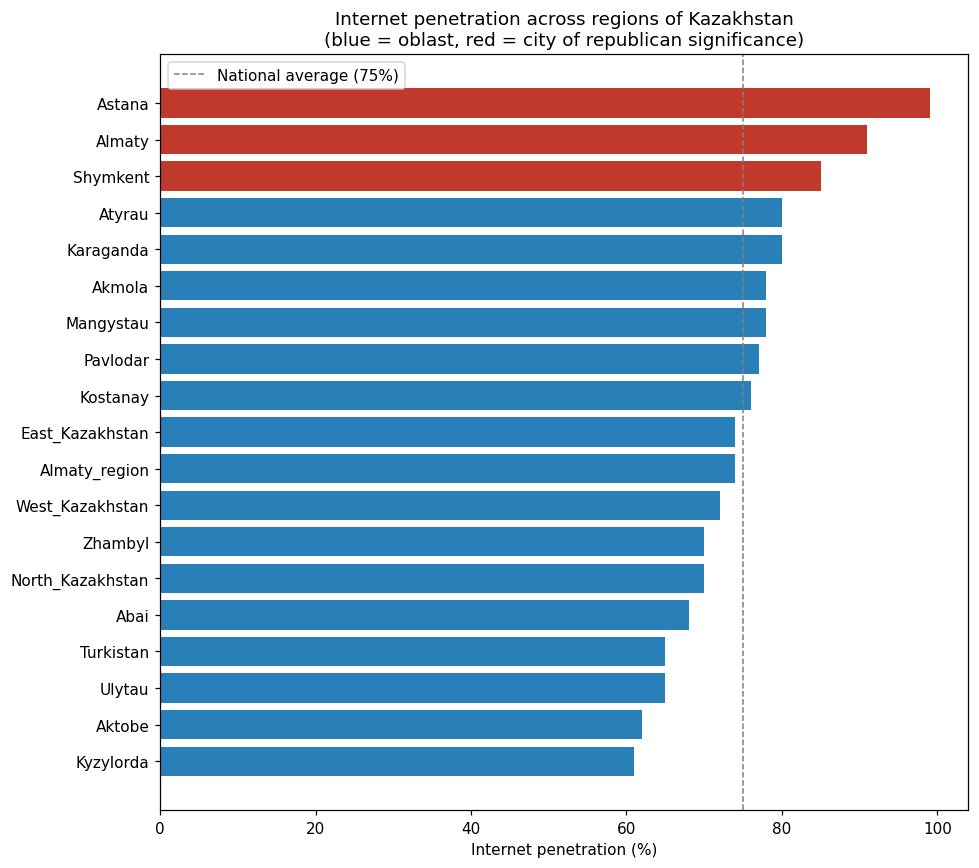
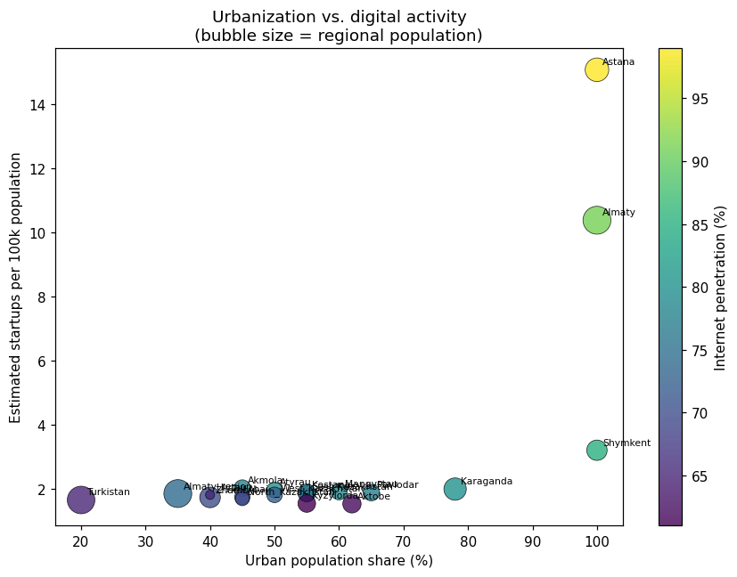
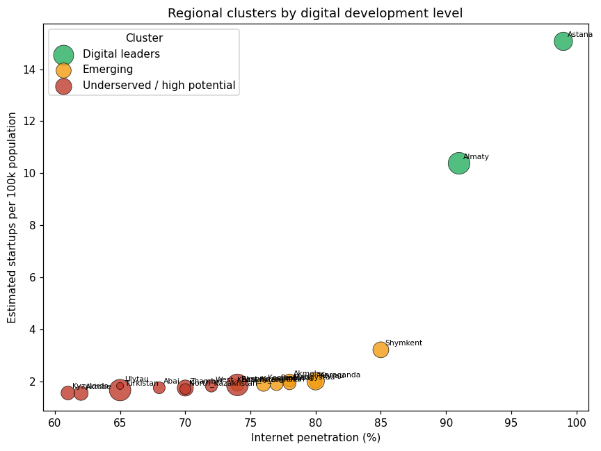

# Why Kazakhstan's Next Tech Hub Shouldn't Be in the Capital

A few months ago, I started sketching out a plan I wanted to be sure about before I put it in writing: after finishing my degree, I want to return to Kazakhstan and build a regional version of Astana Hub — one located outside the capital, connecting local youth with mentors and technology partners from abroad. Before committing that idea to a personal statement, I decided to test it against actual data using Python (`pandas`, `matplotlib`, `scikit-learn`). What I found confirmed the instinct, and sharpened it considerably.

*(Full code and a step-by-step breakdown of the analysis below is in [`notebooks/analysis.ipynb`](notebooks/analysis.ipynb).)*

## A country that looks digitally advanced — on average

On paper, Kazakhstan looks like a digital success story. As of early 2025, roughly 92.9% of the population uses the internet — about 19.2 million people — and that figure has been climbing steadily for over a decade. These are the kinds of numbers that make it easy to assume the digital transformation has reached the whole country evenly.

It hasn't.

## The gap hiding inside the average

When I broke internet penetration down by region instead of looking at the national figure, a different story emerged.

Astana sits close to 99%. Almaty is around 91%. But in several oblasts — Kyzylorda and Aktobe among them — penetration drops to roughly 60–62%. That's close to a **40-percentage-point gap** between the capital and the country's least-connected regions, inside a single nation with a unified telecom infrastructure and a strong national average.

## Where startup activity actually concentrates

The same pattern shows up in Kazakhstan's flagship innovation program, Astana Hub. The cluster has grown into a genuinely significant institution — over 750 resident companies nationwide, billions of dollars in cumulative investment and sales since its founding, and a new $10 million venture fund launched in 2024 specifically to support local and regional startups. It has also built a network of IT hubs across 18 regions, which is a real and meaningful effort at decentralization.

But when I estimate how that activity is likely distributed by region — weighting by population, internet access, and each region's known role as a tech center — the concentration in Astana and Almaty is stark:

*(No public source breaks Astana Hub residents down by region, so this chart uses a transparent, documented estimate rather than an official figure — the exact formula and assumptions are in the notebook.)*

## Who actually lives in the "digital periphery"

To find where the gap between population and digital opportunity is largest, I clustered all 20 regions by internet penetration, urbanization, and estimated startup density using k-means clustering:

The regions with the lowest digital indicators aren't sparsely populated backwaters. **Almaty oblast, Turkistan region, and Zhambyl region** are each home to well over a million people — in Turkistan's case, over two million — and they skew young. These are large, youthful populations with meaningfully less access to digital infrastructure, digital-economy jobs, and the kind of mentorship ecosystem that a hub like Astana Hub provides to founders in the capital.

That combination — large population, low digital opportunity — is precisely where I think a new hub would do the most good. Not because the capital doesn't deserve investment, but because it has already received it, disproportionately, for years.

## What this means for my plan

This is the argument I want to make with my study plan for the **Global Korea Scholarship**: I want to study [your field of study] in Korea, a country that has built some of the world's most effective models for regional and national digital clusters, and bring that knowledge home to build something in one of these specific, underserved regions — not the capital.

Concretely, my plan has three parts:

1. **Learn** — use my time in Korea to study how Korean techno-parks and digital innovation clusters were designed and scaled, and build real relationships with mentors and companies willing to work with founders outside a capital city.
2. **Build** — identify a specific host region (Almaty oblast, Turkistan, or Zhambyl are the strongest candidates by this analysis) and build a hub there modeled on Astana Hub's structure, but designed from the start around connecting local youth to the mentorship and opportunity they currently have far less access to.
3. **Connect** — treat the Korea–Kazakhstan mentor relationship as a permanent feature of that hub, not a one-time launch partnership.

I don't think this idea is original in a dramatic sense — Astana Hub itself is already trying to extend into the regions, and that's worth acknowledging directly. What I want to contribute is focus: building something that starts in a specific underserved region instead of expanding outward from the capital, and treating international mentorship as core infrastructure rather than an add-on.

That's the plan I'm bringing to GKS, and the reason I wanted the numbers behind it to be solid before I wrote it down.

---

### Data sources and methodology

- Regional population — rounded figures from Kazakhstan's Bureau of National Statistics (stat.gov.kz).
- National internet penetration (~92.9%) — Digital 2025: Kazakhstan / DataReportal. Astana (~99%) and Almaty (~91%) figures — Kazakhstan's Statistics Committee and a Wunder Digital study (2025).
- Astana Hub resident count (~750 nationwide) — Ministry of Digital Development statement, 2026.
- Startup activity per region and region-level internet penetration outside the three main cities are **transparent estimates**, not official figures — the full formula and reasoning are documented in [`notebooks/analysis.ipynb`](notebooks/analysis.ipynb).

*This project is part of my application portfolio for the Global Korea Scholarship. I'm happy to walk through the methodology or the code with anyone reviewing it.*
